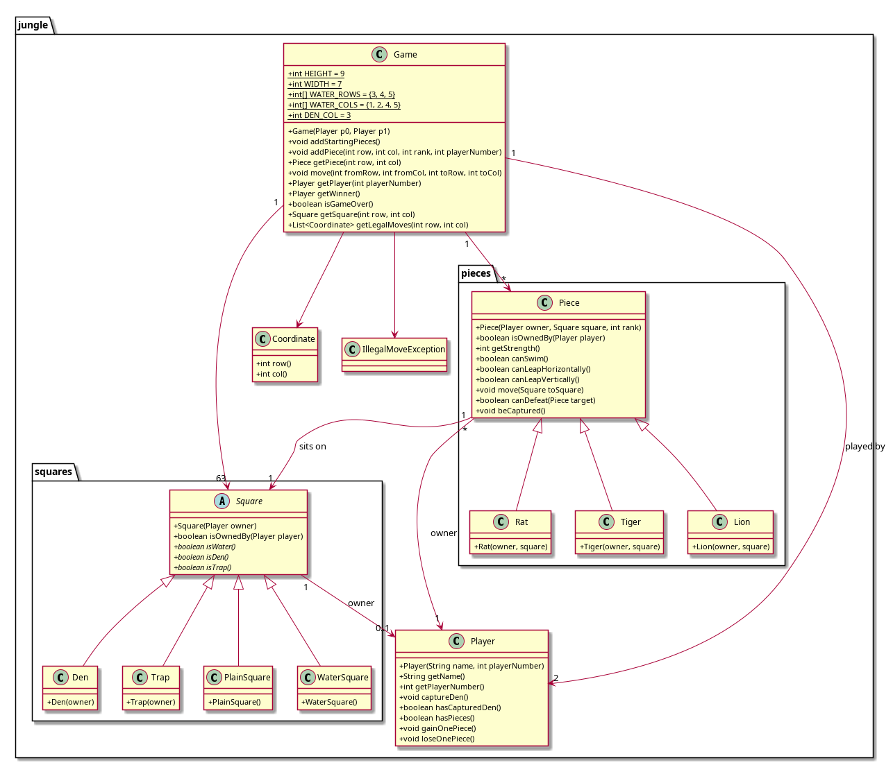
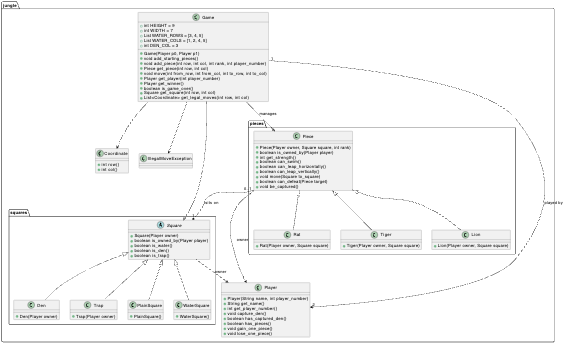

# oo_practice
This repo is using for practices(p1 and p2) of object-oriented programming.

## Structure: p1a, p1b, p2a, p2b
``` bash
p1a
├── stacscheck              
├── tests           # 测试
└── wordcounter     # 源代码放在src中
    └── src
p1b
├── stacscheck
├── tests           # 测试
└── wordcounter     # 源代码放在wordcounter中

p2a
├── uml-diagram.png # 类图
├── stacscheck  
├── Tests           # 测试
└── src
    └── jungle      # 源码

p2b
├── class_diagram.puml  # 类图 plantuml 
├── class_diagram.png   # 类图
├── pyproject.toml  
└── tests           # 测试
└── src
    └── jungle      # 源码
```

## 运行测试

``` bash
# p1a
cd p1a
./stacscheck tests

# p1b
cd p1b
./stacscheck tests

# p2a
cd p2a
./stacscheck Tests

# p2b
cd p2b
pip install -e '.[dev]'
pytest tests -v --tb=short
```

## p2 类图

### p2a



### p2b

